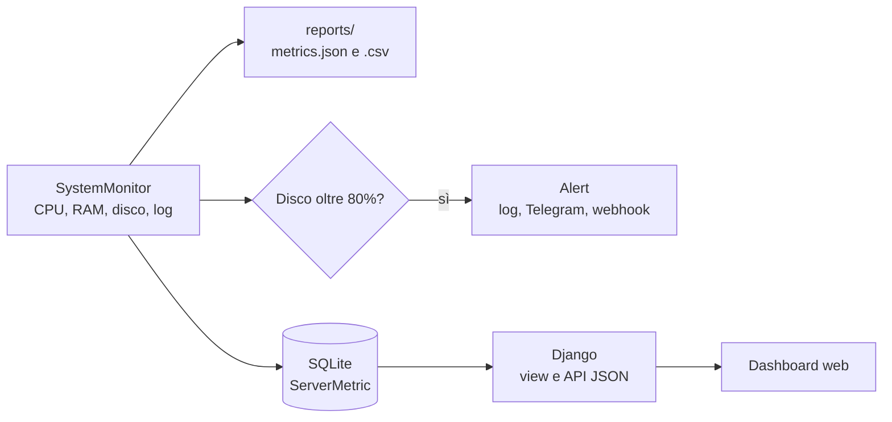

<div align="center">

# Pip-Boy Health

**Monitoraggio dello stato di salute di un server, dallo script alla dashboard web.**


Progetto didattico realizzato da uno studente ICT.

</div>

---

## Di cosa si tratta

Pip-Boy Health rileva **CPU, RAM, spazio disco e ultime righe del log di sistema**, salva le misure in file di report e in un database, e **avvisa quando il disco supera l'80%**. Una dashboard web mostra lo stato in tempo reale: un tracciato ECG che passa dal verde al rosso quando qualcosa non va, tre indicatori ad anello, un grafico dell'andamento e una tabella delle ultime rilevazioni con i valori critici evidenziati.

Il progetto nasce da una traccia di scripting e amministrazione di sistema ed è sviluppato in due parti:

| Parte | Cosa fa | Tecnologie |
|---|---|---|
| **Script e OOP** | Classe `SystemMonitor`: lettura (o simulazione) delle metriche, report JSON/CSV, alert | Python, `psutil`, `urllib` |
| **Web app** | Salvataggio nel database e dashboard con tabella, grafico e valori critici in rosso | Django, SQLite, HTML/CSS/JavaScript |

## Funzionalità

- **Rilevazione delle metriche** reali con `psutil`, oppure simulate per provare il sistema senza un server vero.
- **Report su file**: `metrics.json` e `metrics.csv`, aggiornati a ogni rilevazione.
- **Alert sul disco** oltre la soglia (80% di default) su log, Telegram e webhook HTTP.
- **Database SQLite** con il modello `ServerMetric`, gestibile anche dal pannello `/admin/`.
- **Dashboard** con aggiornamento automatico ogni 15 secondi, pulsante di pausa e notifiche.
- **Grafico interattivo** delle ultime 20 rilevazioni, con tooltip e serie nascondibili.
- **Tabella** con celle critiche in rosso, filtro «Solo critiche» e log di sistema espandibile.
- **Tema chiaro e scuro**, interfaccia adattabile al telefono e senza dipendenze esterne (funziona anche offline).
- **API JSON** su `/api/metrics/` e comando `collect_metrics` adatto a cron.

## Come funziona



Lo stesso `SystemMonitor` serve sia lo script a riga di comando sia la web app: ogni rilevazione scrive i report, controlla la soglia e salva la riga nel database.

## Avvio rapido

Servono Python 3.10 o superiore e il progetto scaricato (o clonato) in locale.

### Linux e macOS
```bash
cd system_health

python3 -m venv .venv
source .venv/bin/activate
pip install -r requirements.txt

python manage.py migrate
python manage.py collect_metrics --simulate --count 10
python manage.py runserver
```

### Windows (Prompt dei comandi)
```cmd
cd system_health

py -m venv .venv
.venv\Scripts\activate.bat
pip install -r requirements.txt

python manage.py migrate
python manage.py collect_metrics --simulate --count 10
python manage.py runserver
```

### Windows (PowerShell)
```powershell
cd system_health

py -m venv .venv
Set-ExecutionPolicy -Scope CurrentUser RemoteSigned   # una sola volta
.venv\Scripts\Activate.ps1
pip install -r requirements.txt

python manage.py migrate
python manage.py collect_metrics --simulate --count 10
python manage.py runserver
```

Poi apri **http://127.0.0.1:8000/**. Per fermare il server premi `Ctrl+C`.

## Utilizzo

**Script da riga di comando**
```bash
python system_monitor.py                        # misure reali
python system_monitor.py --simulate --disk 92   # forza il disco al 92% e fa scattare l'alert
```

**Dashboard**: «Rileva ora» salva una misura reale, «Rileva con dati simulati» una misura casuale. Con `python manage.py createsuperuser` crei l'utente per accedere a `/admin/`.

**Alert su Telegram o webhook** (facoltativi): imposta le variabili d'ambiente prima di avviare.

| Variabile | Effetto |
|---|---|
| `TELEGRAM_BOT_TOKEN` e `TELEGRAM_CHAT_ID` | messaggio Telegram |
| `ALERT_WEBHOOK_URL` | richiesta HTTP POST con `{"text": "..."}` |

**Rilevazione periodica**: su Linux con cron (`*/5 * * * * cd /percorso/system_health && .venv/bin/python manage.py collect_metrics`), su Windows con l'Utilità di pianificazione.

## Struttura del repository

```
system_health/
├── system_monitor.py          classe SystemMonitor (script standalone)
├── manage.py
├── requirements.txt
├── config/                    impostazioni Django (SQLite, lingua italiana)
├── metrics/
│   ├── models.py              modello ServerMetric
│   ├── services.py            collega SystemMonitor al database
│   ├── views.py, urls.py      dashboard, rilevazione, API JSON
│   ├── management/commands/   comando collect_metrics
│   ├── templates/metrics/     dashboard.html
│   ├── static/metrics/        dashboard.css, dashboard.js
│   └── tests.py
├── tests/                     test dello script
└── reports/                   metrics.json, metrics.csv, alerts.log
```

## Test

```bash
python -m unittest discover -s tests    # script SystemMonitor
python manage.py test                   # parte Django
```

## Possibili sviluppi

- Monitoraggio di più server, con una rilevazione per host.
- Soglie configurabili dalla dashboard invece che nel codice.
- Storico a lungo termine con grafici su ore, giorni e settimane.
- Lettura reale del log di sistema anche su Windows (Event Viewer).
- Esecuzione in un container Docker.

## Note

Il progetto è pensato per uso locale e didattico: `DEBUG` è attivo e la chiave segreta è quella di sviluppo. Per un uso reale imposta `DJANGO_DEBUG=0`, `DJANGO_SECRET_KEY` e `DJANGO_ALLOWED_HOSTS`.

---

<div align="center">Progetto di uno studente ICT · Python, Django, SQLite</div>
